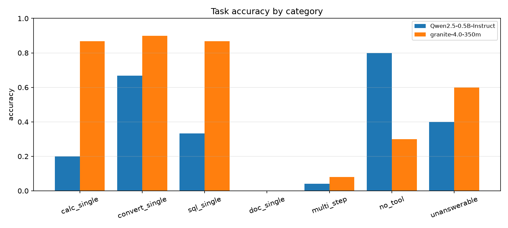
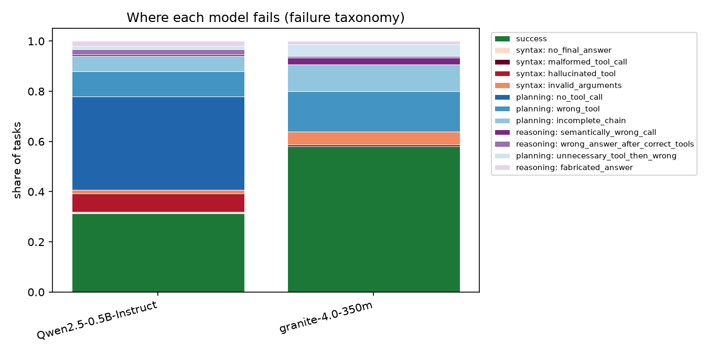

# SLM-Agent Lab

**How small — and how compressed — can a tool-calling language-model agent get before it breaks, and *where* does it break?**

A research-style project in four connected stages, built around one evaluation harness:

```
[1] Eval harness ─ 4 deterministic tools, 300 exact-answer tasks, full trajectory logs, 13-label failure taxonomy
        │   (correct teacher trajectories become training data)
[2] Distillation ─ teacher → 350M/1B student via LoRA; controlled rank × lr × seed sweep
        │   (the sweep's adapters are the input)
[3] Reproduction ─ LoRA paper §7: low-rank sufficiency + subspace-similarity analysis, on our own adapters
        │   (the trained models are what gets served)
[4] Serving ─ vLLM on Kubernetes, fp16/int8/int4 × concurrency, Prometheus/Grafana, harness run *through* the server
        ▼
   accuracy vs. throughput, one point per (model, adapter, precision), coloured by dominant failure type
```

Everything in stages 1–3 runs on a CPU laptop (that is where this was built); stage 2's full sweep and stage 4
need a GPU (free Kaggle/Colab T4 is enough for stage 2).

## Status

| stage | state |
|---|---|
| 1. harness, task set, taxonomy, baselines | **done** — 24 unit tests, 300-task test split + 300-task train split, baseline runs for Granite 4.0 350M and Qwen2.5 0.5B logged in `results/runs/` |
| 2. distillation data + LoRA sweep | **code done, pipeline smoke-tested on CPU**; full sweep = `notebooks/02_lora_sweep_kaggle.ipynb` (≈ 2 h on a T4) |
| 3. LoRA paper reproduction | **analysis code done + smoke-tested**; numbers pending the stage-2 sweep → [REPRODUCTION.md](REPRODUCTION.md) |
| 4. serving benchmark | **scripts + K8s manifests written, not executed** (no GPU on the dev machine) → [serve/README.md](serve/README.md) |

## Headline results (stage 1, CPU laptop, greedy decoding, 150-task stratified subset)

<!-- RESULTS:BEGIN -->
| model | n | acc | strict acc | acc (iid) | acc (ood) | tool calls/task | tool error rate | malformed rate | compl. tokens/task | tokens/s |
|---|---|---|---|---|---|---|---|---|---|---|
| Qwen2.5-0.5B-Instruct | 150 | 31.3% | 30.0% | 36.1% | 12.9% | 0.53 | 35.0% | 0.0% | 87.1 | 3.12 |
| granite-4.0-350m | 150 | 58.0% | 50.0% | 65.5% | 29.0% | 0.99 | 16.1% | 0.7% | 61.4 | 4.42 |


#### Accuracy by category

| model | calc_single | convert_single | sql_single | doc_single | multi_step | no_tool | unanswerable |
|---|---|---|---|---|---|---|---|
| Qwen2.5-0.5B-Instruct | 20% | 67% | 33% | 0% | 4% | 80% | 40% |
| granite-4.0-350m | 87% | 90% | 87% | 0% | 8% | 30% | 60% |


#### Failure taxonomy (count of tasks)

| model | no_final_answer | malformed_tool_call | hallucinated_tool | invalid_arguments | no_tool_call | wrong_tool | incomplete_chain | semantically_wrong_call | wrong_answer_after_correct_tools | unnecessary_tool_then_wrong | fabricated_answer |
|---|---|---|---|---|---|---|---|---|---|---|---|
| Qwen2.5-0.5B-Instruct | 1 | 0 | 11 | 2 | 56 | 15 | 9 | 1 | 3 | 2 | 3 |
| granite-4.0-350m | 0 | 1 | 0 | 8 | 0 | 24 | 16 | 4 | 1 | 7 | 2 |


#### Failure groups

| model | syntax (can't talk to tools) | planning (wrong/no tool) | reasoning (wrong use/answer) |
|---|---|---|---|
| Qwen2.5-0.5B-Instruct | 14 (9%) | 82 (55%) | 7 (5%) |
| granite-4.0-350m | 9 (6%) | 47 (31%) | 7 (5%) |
<!-- RESULTS:END -->




### Key findings (150 tasks per model, same stratified subset, greedy decoding, CPU fp32)

1. **Granite-4.0-350M: 58 % overall, Qwen2.5-0.5B: 31 %.** On single-tool tasks Granite is strong (calc 87 %,
   unit conversion 90 %, SQL 87 %) and emits a well-formed `<tool_call>` block in 149 of 150 trajectories
   (malformed rate 0.7 %). Its failures are almost entirely **planning** (47 of 63 failures), not syntax.
2. **Tool selection collapses to the "database" tool.** Both models score **0 % on document questions**: Granite
   answers them with `sql_query` (13/20, inventing tables such as `wellness_sessions`) or an invented
   calculator expression; Qwen narrates a tool it never calls. Granite *does* call `doc_search` — 15 times,
   7 of them in multi-step prompts that name a document ("Using the Laptop Pro 14 specification…") — so the
   skill exists but is only triggered by a surface cue. This is the first thing stage-2 fine-tuning should fix,
   and the train split contains exactly those trajectories.
3. **Qwen2.5-0.5B's dominant failure is not calling tools at all** (`no_tool_call`, 56/150): it does the
   arithmetic in its head (153 / 3.5 → "44.62") or describes a plan ("I will use unit_convert…") and stops. When
   it does call, 13 of 81 calls use a **hallucinated tool name** (`sqrt`, `div`, `mathematical_operation`,
   `round`) lifted from the calculator's description — a tool-description design lesson: listing function
   names invites the model to call them as tools.
4. **Multi-step is where both break** (8 % and 4 %): Granite's main label is `incomplete_chain` (16) — it runs
   the SQL, gets 105 750, and reports it as the answer "in thousands" instead of calling the calculator. Chains
   requiring 2+ tools are the capability gap, not individual tool use.
5. **Right tools, corrupted numbers.** The rare `wrong_answer_after_correct_tools` cases are all number-copying
   errors: SQL returns −26 305.6, the model writes "26,906"; −16 795 becomes "17,995". Small models drop signs
   and transpose digits when transcribing observations — a failure that neither retrieval nor planning fixes.
6. **OOD generalisation halves accuracy** (Granite 65.5 % iid → 29.0 % ood; Qwen 36.1 % → 12.9 %), mostly because
   the OOD set is dominated by the harder chains and unseen-document questions.
7. **Opposite no-tool behaviour.** Granite over-uses tools on general-knowledge questions (8/10, e.g.
   `doc_search("URL")`, then answers "no results found" → 30 %), Qwen answers them directly (80 %). Over- and
   under-use of tools are different failure modes with different fixes; the taxonomy keeps them separate.
8. **Strict vs lenient scoring matters for Granite** (58 % lenient vs 50 % strict): in 8 % of its tasks the right
   value is in the answer but the sentence ends on a different number — a formatting problem worth measuring
   rather than hiding in either direction.
9. **Cost.** Granite needed 61 completion tokens/task vs Qwen's 87 and ran 40 % faster per token (4.4 vs 3.1
   tok/s on this CPU) — the more accurate model is also the cheaper one, which is not a given.

## Stage 1 — the harness

### Tools (all deterministic, so every task has an exact ground truth)

| tool | what it is | typical failure it exposes |
|---|---|---|
| `calculator` | AST-based safe arithmetic (`+ - * / ** %`, `sqrt`, `round`, …) | digit transposition when copying numbers into the expression |
| `unit_convert` | 40+ units across length/mass/temperature/volume/time/speed/data | wrong unit name, wrong direction |
| `sql_query` | read-only SQLite over a seeded 60-employee / 120-order / 12-product company DB | wrong column, wrong value format, right rows → wrong reading |
| `doc_search` | BM25 over 24 synthetic policy/spec/report documents with an explicit fact table | picks `sql_query` for a document question; retrieves the doc, misreads the number |

Tool errors never crash the loop: the registry returns a structured error with an `error_kind`
(`unknown_tool` / `missing_argument` / `bad_argument` / `execution`) that the taxonomy consumes. Near-miss argument
names (`expr`, `from`, `q`, …) are accepted **and logged** as leniencies.

### Task set (`python scripts/make_tasks.py`)

300 test tasks + 300 disjoint train tasks, generated from seeded templates; ground truth is computed by the same
tool code the agent calls (no label noise).

| category | n | example | reference tools |
|---|---|---|---|
| `calc_single` | 60 | *An item costs 847.20 USD and is discounted by 35%. What is the final price?* | calculator |
| `convert_single` | 60 | *A package weighs 83.4 pounds. What is its mass in kilograms?* | unit_convert |
| `sql_single` | 60 | *Who is the highest-paid employee in the Finance department?* | sql_query |
| `doc_single` | 40 | *Within how many days must expense reports be submitted?* | doc_search |
| `multi_step` | 50 | *Use the Laptop Pro 14 spec for its weight and the products table for its stock: total stock weight in kg?* | doc_search → sql_query → calculator → unit_convert |
| `no_tool` | 20 | *What does SQL stand for?* (correct behaviour: answer directly) | — |
| `unanswerable` | 10 | *What is the salary of the employee named Zubin Mistry?* (not in the DB; must say so) | — |

56 of the 300 test tasks are **OOD**: templates (compound interest, time/speed conversions, 4-tool chains, …) and
four whole documents that never appear in the train split, so stage-2 fine-tuning can be scored on
in-distribution vs. out-of-distribution generalisation.

### Agent loop and parsing

`slm_agent_lab/agent/loop.py` renders the conversation with the model's **own chat template** (`tools=` when
the template supports it, a plain-text fallback otherwise), generates greedily, parses tool calls, executes
them, appends the observation and repeats (max 6 steps, loop detection, one retry on malformed output).

The parser (`agent/parsing.py`) understands five dialects — `<tool_call>` blocks, Granite-3 `<|tool_call|>`,
fenced JSON, bare JSON, `tool(arg=…)` python style — repairs the common JSON sins (single quotes, trailing commas,
arguments passed as a string) and **records which dialect each call used and whether repair was needed**. Output
that looks like a call but cannot be parsed is returned as `malformed`, not silently dropped.

Backends: local Transformers (`HFBackend`, CPU/GPU, optional merged LoRA adapter) and any OpenAI-compatible
server (`OpenAICompatBackend`, used for vLLM in stage 4). Both render the identical prompt, so results across
stages are comparable.

### Scoring and the failure taxonomy

Numbers are matched with a per-task tolerance (0.5 for integer answers, max(0.011, 0.5 %) otherwise); the last
number in the final-answer segment is the *strict* match, any number in the text the *lenient* one — both are
reported. Strings use word-boundary matching; `unanswerable` uses a negation heuristic (documented limitation).

Every incorrect trajectory gets exactly one primary label from a fixed decision tree (`eval/taxonomy.py`):

| group | label | meaning |
|---|---|---|
| syntax | `malformed_tool_call` | tried to call a tool, nothing parseable came out |
| syntax | `hallucinated_tool` | called a tool that does not exist |
| syntax | `invalid_arguments` | right tool, call rejected (bad/missing args, SQL error, unknown unit) |
| syntax | `no_final_answer` | ran out of steps, looped, or produced nothing scoreable |
| planning | `no_tool_call` | task needed a tool, model answered from memory |
| planning | `wrong_tool` | only unrelated tools were used (checked *before* execution errors) |
| planning | `incomplete_chain` | multi-step task, some required tools never called |
| planning | `unnecessary_tool_then_wrong` | no-tool question, used tools, got it wrong |
| reasoning | `semantically_wrong_call` | valid calls, but the needed value never appeared in any observation |
| reasoning | `wrong_answer_after_correct_tools` | the needed value **was** in a tool output; synthesis failed |
| reasoning | `knowledge_error` | no-tool question answered directly and wrongly |
| reasoning | `fabricated_answer` | unanswerable question, model asserted an answer |

The split between `semantically_wrong_call` and `wrong_answer_after_correct_tools` is the useful one for
debugging: it is decided by checking whether the expected answer occurs in any tool observation, i.e. whether the
agent *had* the information. Secondary flags (recovered from a tool error, JSON repaired, text generated after
the call = fabricated observation, unnecessary tool use, extra steps) are logged alongside.

### Trajectory logs

`results/runs/<model>/trajectories.jsonl` — one JSON record per task: every step's raw output, parsed calls with
dialect, tool results with latency and error kind, token counts, generation time, termination reason, score,
label and flags. `scripts/inspect_run.py` pretty-prints them filtered by label:

```bash
python scripts/inspect_run.py results/runs/granite-4.0-350m --summary
python scripts/inspect_run.py results/runs/granite-4.0-350m --label wrong_answer_after_correct_tools --n 3
```

## Stage 2 — distillation and the controlled LoRA sweep

* `scripts/build_sft_data.py --source teacher --run <teacher run on train split>` keeps only trajectories the
  harness scored correct (rejection-sampled sequence-level distillation); `--source oracle` replays the gold
  tool calls through the real tools for a perfect-trajectory comparison.
* `slm_agent_lab/train/lora.py` fine-tunes with PEFT, **assistant-only loss masking** computed from the chat
  template's own rendering, and a fixed recipe; `scripts/lora_sweep.py` varies only rank, lr and seed and
  writes one row per run (`sweep.csv`: eval loss before/after, trainable %, train time, harness accuracy).
* `notebooks/02_lora_sweep_kaggle.ipynb` runs the whole stage on a free T4: teacher = Granite 4.0 H-Micro (3B),
  student = Granite 4.0 350M, reduced grid 4 ranks × 2 lrs × 3 seeds, plots accuracy vs. rank with error bars.

## Stage 3 — reproduction

[REPRODUCTION.md](REPRODUCTION.md): what Hu et al. (2021) claim, which table/figure is reproduced, the exact φ
formula, every deliberate deviation (350M vs 175B, tool-calling vs WikiSQL, 290 vs 56k examples) and how to
read differences. Includes a random-matrix baseline so φ values have a reference at our hidden size.

## Stage 4 — serving

[serve/README.md](serve/README.md): vLLM Deployment + Service + ServiceMonitor for Kubernetes, PromQL for the
Grafana panels, and `serve/bench.py`, which sweeps concurrency (throughput, TTFT, p50/p95 latency) using the
real agent prompts **and** runs the task harness through the server so each precision gets a failure taxonomy.

## Repository layout

```
slm_agent_lab/
  tools/        calculator, unit_convert, sql_query, doc_search, registry (schemas + dispatch)
  tasks/        schema + seeded generator (test/train, OOD marking, gold trajectories)
  agent/        parsing (5 dialects), backends (HF / OpenAI-compatible), loop (trajectory logging)
  eval/         scoring, taxonomy, runner (resumable JSONL), report (tables + figures)
  train/        sft_data (oracle / teacher), lora (masked SFT + sweep), subspace (LoRA §7.2)
scripts/        make_tasks, run_eval, make_report, inspect_run, smoke_test, build_sft_data, lora_sweep,
                subspace_analysis, merge_adapter
serve/          bench.py, k8s/vllm-deployment.yaml, README.md
notebooks/      01_baseline_eval.ipynb, 02_lora_sweep_kaggle.ipynb
data/           corpus/docs.json (documents + fact table), tasks/*.jsonl, company.sqlite (export), sft/
results/        runs/<model>/{trajectories.jsonl, meta.json}, report/, sweep*/, logs/
docs/figures/   generated figures
tests/          tools, parsing, scoring/taxonomy/generation (pytest)
```

## Quickstart

```bash
git clone https://github.com/Gangadhar017/SLM-agent-Lab.git && cd SLM-agent-Lab
python -m venv .venv && . .venv/bin/activate        # Windows: .venv\Scripts\activate
pip install torch --index-url https://download.pytorch.org/whl/cpu   # or a CUDA build
pip install -r requirements.txt
python -m pytest -q
python scripts/make_tasks.py
python scripts/smoke_test.py --model ibm-granite/granite-4.0-350m --n 5
python scripts/run_eval.py --model ibm-granite/granite-4.0-350m --limit 150      # ~35 min on a 4-core CPU
python scripts/run_eval.py --model Qwen/Qwen2.5-0.5B-Instruct --limit 150
python scripts/make_report.py                                                    # tables + figures
```

Any Hugging Face chat model works (`--model ibm-granite/granite-4.0-1b`, `Qwen/Qwen2.5-1.5B-Instruct`, …);
runs are resumable and `--limit` draws the same stratified subset for every model.

## Reproducibility notes and known limitations

* Seeds fix the DB contents, the task set and the subset; greedy decoding makes model runs deterministic on a
  given machine/library version (`meta.json` records versions and platform).
* Throughput numbers from `results/runs/` are **CPU fp32** — relative, not absolute.
* `unanswerable` scoring is a negation heuristic; `expected_tools` is one reference path, so a wrong answer via a
  different valid path can be labelled `incomplete_chain` — the label is diagnostic, never part of accuracy.
* Numeric tolerance is relative (0.5 %); a model that is "almost right" by rounding is counted right.
* Task templates are synthetic; the corpus and DB are small by design (exact ground truth over realism).

## Roadmap

* Granite 4.0 1B and Qwen2.5 1.5B baselines on the full 300 tasks (overnight CPU job, or minutes on a GPU)
* Full stage-2 sweep on Kaggle, fill REPRODUCTION.md tables
* DPO on the harness's correct/incorrect trajectory pairs (preference data falls out of the logs)
* Stage 4 on a rented GPU node; fused RMSNorm kernel in OpenAI Triton vs. PyTorch eager / `torch.compile`

## References

* Hu et al., *LoRA: Low-Rank Adaptation of Large Language Models*, 2021 — arXiv:2106.09685
* IBM Granite 4.0 (incl. the 350M / 1B "Nano" models) — https://huggingface.co/ibm-granite
* Qwen2.5 Technical Report, 2024 — arXiv:2412.15115
* Berkeley Function Calling Leaderboard (related evaluation methodology for tool use)
